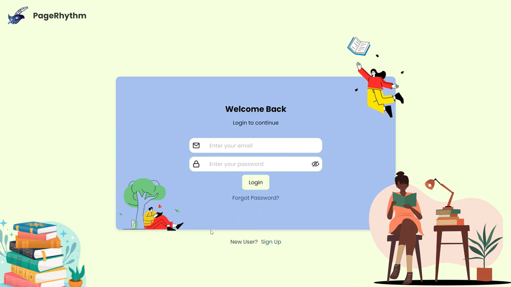

# CS300 Project - PageRhythm

## Overview

- PageRhythm is a web application that allows users to read books and listen to audiobooks generated with customized voices.

  

## Features

- Browse and read books directly in the browser.
- Listen to books with dynamically generated, customizable voices.
- Clean, user-friendly interface for seamless reading and listening.

## Locall Run

The application can also be run locally by following these instructions:

1. The back-end component can be started by executing the `app.py` file, with the root directory located at the `page-rhythm/src/BackEnd/PageRhythm` path.

   It is also important to ensure that the required packages are installed before running the component. These packages can be installed easily using the command: `pip install -r requirements.txt`.

   Furthermore, the `.env` file is also needed to be created and configured before running the component. The necessary fields for the file can be found in the `.env.example` template.

2. The front-end component can be started by running the command `npm run build` from the root directory located at `pagerhythm/src/FrontEnd/PageRhythm`.
