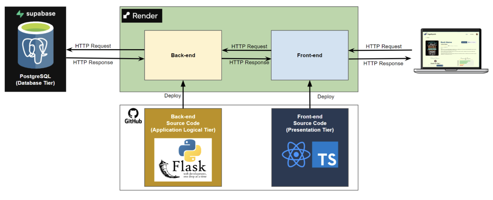

# CS300 Project - PageRhythm

## Overview

- PageRhythm is a web application that allows users to read books and listen to audiobooks generated with customized voices.

  

## Features

- Browse and read books directly in the browser.
- Listen to books with dynamically generated, customizable voices.
- Clean, user-friendly interface for seamless reading and listening.

## Local Run

The application can also be run locally by following these instructions:

### Prerequisites

- Python 3.x and pip
- Node.js 18+ and npm

### 1. Back-end

Start the back-end from the `page-rhythm/src/BackEnd/PageRhythm` directory:

```bash
cd src/BackEnd/PageRhythm
pip install -r requirements.txt
python app.py
```

The required packages are installed via `pip install -r requirements.txt`, and the `.env` file must be created and configured before running (see the `.env.example` template for the necessary fields).

### 2. Front-end

Start the front-end from the `page-rhythm/src/FrontEnd/PageRhythm` directory:

```bash
cd src/FrontEnd/PageRhythm
npm install
npm run dev
```

## Tech Stack

Both back-end and front-end applications are deployed through [Render](https://render.com/).

   

### Back-end

The back-end application is a **Flask** REST API that stores its data in **Supabase** (a hosted PostgreSQL database) and produces audiobook narration by calling the **ElevenLabs** text-to-speech API.

### Front-end

The front-end application is a **React** web client written in **TypeScript** and built with **Vite**.
